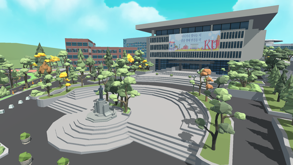
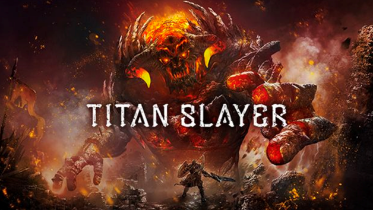

<style type='text/css'>
 r {background-color: crimson; color: white; font-weight:bold;}
 y {background-color: gold; color: white; font-weight:bold;}
 b {background-color: deepskyblue; color: white; font-weight:bold;}
 g {background-color: limegreen; color: white; font-weight:bold;}
</style>  

# 캠퍼스 서바이벌(Campus Survival)

# 목차
> [1. 컨셉](#concept)  
> [2. 참고 자료](#reference)  
> [3. 대표 이미지](#main_img)  
> [4. 컨셉 & 대표이미지 기반 작품묘사](#description)  
> [5. 「캠퍼스 서바이벌」 구성 요소](#component)  
> [6. 게임 시스템 디자인](#sys_design)  
> [7. 개발 요구사항 & 흐름도](#requirements_flowchart)

# 1. 컨셉<a name = "concept"/>

## Main Concept : 대학 과정
> 대학교 생활(1~4학년)에서 겪는 여러 난관들을 처치하며 졸업을 목표로 게임을 진행.  
> 대학생활을 겪어본 유저들로부터 공감대를 형성시켜 게임의 몰입도 증가.

### Sub Concept-1 : 스트레스 해소
> 대학 생활에서 나오는 여러가지 스트레스 요인들을 부숴가며 스트레스 해소.

### Sub Concept-2 : 밈(공감대)
> 많은 대학생들이 공감할 만한 밈이나 상황들을 추려내서 공감대를 형성.

### Sub Concept-3 : 타격감
> 타격 이펙트, 사운드 에 중점을 두어 타격감이 넘치는 게임.

### Sub Concept-4 : 배재대학교
> 배재대학교 캠퍼스를 배경으로 제작. 배재대 학생들의 흥미를 유발.

### Sub Concept-5 : VR(Virtual Reality)
> VR기반으로 게임을 개발해서 색다른 경험 제공.
<br/>

# 2. 참고 자료<a name = "reference"/>
## 이미지
<p align="center">
 <br/>
 <em>건국대학교 메타버스</em>
</p>
 
## 동영상
<p align="center">
 
 <br/>
 <a href="https://www.youtube.com/watch?v=2u_eTJbBGb0" target="_blank">
  Titan Slayer(게임 플레이 방식)
 </a>
</p>

# 3. 대표 이미지<a name = "main_img"/>
<p align="center">
 
</p>

<br/><br/>

# 4. 컨셉 & 대표이미지 기반 작품묘사<a name = "description"/>

### 대표이미지 기반
 > 레고와 비슷한 블럭 모양으로 오브젝트를 구성.
 > 배재대학교 캠퍼스 전경을 참고.

### 컨셉 기반
 > 스테이지 구성을 대학생활에 맞추어 구성.   
 > 오브젝트가 플레이어를 향해 날아오면 그것을 파괴해나가면서 점수를 얻어나간다.  
 > 플레이어를 향해 날아오는 오브젝트들은 대학생활을 하면서 공감갈 만한 내용들로 구성.  
 > 플레이어가 오브젝트 파괴에 성공했을 시 타격음과 이펙트, 컨트롤러 진동으로 파괴했다는 정보를 확실히 전달.
 > Oculus Quest2의 컨트롤러를 이용해서 게임을 진행.

# 5. 「캠퍼스 서바이벌」 구성 요소<a name = "component"/>

## 5-1. 메커니즘
[게임 방식]
> 1. VR게임으로 주어진 무기를 이용해 밀려오는 적(과제물)을 처치. 플레이어는 고정된 위치에서 플레이 한다.  
> 2. 무기는 스테이지 클리어(학년 진급) 시 차등 지급. 첫 스테이지에는 한손검을 소지. 한손검의 경우 휘두르는 모션을 통해 적을 공격할 수 있다.  
> 3. 학년이 넘어갈 때 마다 총, 방패, 광선검을 지급.   
> 4. 총은 트리거를 사용해 격발이 가능하고, 광선검은 트리거를 당긴채 휘두르면 넓은 범위의 검기를 발사. 방패는 날아오는 공격을 막아낼 수 있음.  
> 5. 무기는 메뉴키를 통해 교체가 가능하며, 교체 시 쿨타임 적용. 적들의 타입마다 효과적인 무기가 있다. 이를 잘 캐치해서 진행하는 것이 중요.

 [도전 과제]
> 1. 총 4개의 스테이지로 구성(대학교 1학년 ~ 4학년) 각 스테이지 마다 일반적인 적(과제물)과 특수한 적(중간, 기말고사)로 구성.  
> 2. 체력을 유지한 채 스테이지 클리어 시 게임 성과에 따라 점수(성적) 책정.  
> 2. 체력을 전부 소진 시 스테이지 종료 및 게임 오버. 최종 단계 클리어 시 졸업 축하 메세지와 함께 성적 표시.  
 
 [재미 요소]
> 1. 스테이지마다 나오는 적들을 각 학년마다 있을 법한 어려운 일들로 구성해 공감을 이끌어낸다.
> 2. 난이도는 총 두가지(easy, hard)로 설정해 플레이어의 성향에 맞게 플레이 가능.
> 3. 2player 모드(깐부 모드(협동)/라이벌 모드(경쟁))를 구현해 친구와 같이 즐길 수 있음(예정).

## 5-2. 이야기
[시놉시스]
```
"드디어 나의 캠퍼스 라이프가 시작되는구나!"
2022년 배재대학교에 신입생으로 입학하게된 배나섬 군(20, 남).
갓 성인이 된 나섬군은 큰 기대를 안고 대학 생활을 시작하게 된다.
앞으로 펼쳐질 그의 미래는...
```

[만들게 된 배경]  
> 대학 생활에서의 어려움은 많은 사람들의 공감을 얻어낼 수 있을거라 생각했고,  
> 본인도 직접 경험하고 있기에 이를 재미 요소로 승화시켰을 때 아이디어들을 많이 얻을 수 있을거라 생각했다.

[카메라 관점]  
> VR 1인칭 시점. 플레이 영역에 제한을 두어 VR멀미를 최소화 시킬 예정.  
> 적의 공격은 플레이어가 바라보는 시점을 기준으로 좌로 60º, 우로 60º, 총 120º 정도로 설정해서 최대한 시야 내에서 공격이 들어오도록 설정.

## 5-3. 미적요소

 [컬러]  
> 1. 배경 - 배재대 캠퍼스를 배경으로 구현해 배재대 학생들의 흥미를 유발.
> 2. 적 디자인 - 불꽃, 악마 등을 귀엽게 디자인해서 확실하게 적의 느낌을 주면서도 게임의 전반적인 분위기는 밝게 설정.
> 3. 컬러 - 파스텔톤으로 구성해 전반적으로 화사한 캠퍼스 느낌을 줌.

[음향]  
> 1. 공격과 피격의 타격음을 확실하게 설정하여 타격감을 극대화.
> 2. 밈 요소의 더빙을 통해 또 다른 재미 추가.

## 5-4. 기술
> 1. Unity 기반 VR게임
> 2. Oculus Quest2 환경 개발
> 3. 최대 2player 멀티플레이 지원(예정)
 
# 6. 게임 시스템 디자인<a name = "sys_design"/>  
[게임 오브젝트]  

| 오브젝트 타입 | 오브젝트 이름                 | 오브젝트 이미지 | 비고             |
| :-----------: | :-----------                  | :------------:  | :-----:          |
| weaponObj     | 한손검(sword)                 |                 | <y>stage 1</y>   |
| weaponObj     | 총(gun)                       |                 | <g>stage 2</g>   |
| weaponObj     | 방패(shield)                  |                 | <b>stage 3</b>   |
| weaponObj     | 광선검(lightSaber)            |                 | <r>stage 4</r>   |
| enemyObj      | 병아리(chick)                 |                 | <y>stage 1</y>   |
| enemyObj      | 화난 병아리(angryChick_       |                 | <y>stage 1</y>   |
| enemyObj      | 달걀(egg)                     |                 | <y>stage 1</y>   |
| enemyObj      | 흰색 닭(chicken)              |                 | <y>stage 1</y>   |
| enemyObj      | 검은색 닭(blackChicken)       |                 | <y>stage 1</y>   |
| enemyObj      | 황금 닭(goldChicken)          |                 | <y>stage 1</y>   |
| enemyObj      | 황금 깃털(goldFeather)        |                 | <y>stage 1</y>   |
| enemyObj      | 악마(devil)                   |                 | <g>stage 2</g>   |
| enemyObj      | 박쥐(bat)                     |                 | <g>stage 2</g>   |
| enemyObj      | 대왕 박쥐(bigBat)             |                 | <g>stage 2</g>   |
| enemyObj      | 전공 교수님(majorProfessor)   |                 | <g>stage 2</g>   |

[플레이어 파라미터]  

| 파라미터              | 설명                                      |  비고                                 |
| :-----------          | :-----------                              | :------------                         |
| helthPoint(체력)      | 플레이어의 체력 수치                      | 개발 진행 상황에 따라 삭제될 수 있음  |
| weapon(무기)          | 플레이어가 들고 있는 무기                 | 게임 진행 도중 변경 가능              |
| weaponBag(무기)       | 무기를 선택할 수 있는 선택창              | 게임 진행 도중 오픈 가능              |
| score(점수)           | 플레이어가 처치한 적에 따라 증가하는 점수 |                                       |

[enemy 파라미터]  

| 파라미터              | 설명                                      |  비고                                 |
| :-----------          | :-----------                              | :------------                         |
| grade(등급)           | enemy의 등급                              | normal, elite, boss로 구분            |
| point(포인트)         | enemy를 처치할 시 얻는 점수               | grade에 따라 결정                     |
| helthPoint(체력)      | ememy의 체력 수치                         | boss grade에만 적용                   |

[플레이어 액션 리스트]  

| 액션                  | 설명                                                                                  |
| :-----------          | :-----------                                                                          |
| chooseWeapon          | weaponBag 활성화                                                                      |
| gutShooting           | 트리거를 당길시 총알(bulletObj)이 나감                                                |
| swordAura             | 트리거를 당기고 lightSaber를 휘두를시 전방으로 검기 방출                              |
| killEnemy             | player의 움직임에 따라weaponObj와 enemyObj가 상호작용시 enemyObj가 사라지며 점수 획득 |

[enemy 액션 리스트]  

| 액션                  | 설명                                                                                  |
| :-----------          | :-----------                                                                          |
| taggingEnemy          | enemyObj에 stage에 따른 이름을 붙혀줌                                                 |
| generateEnemy         | 랜덤한 위치에서 enemyObj 생성 후 플레이어를 향해 날아감                               |
| crashEnemy            | weaponObj와 상호작용을 하여 enemyObj 터짐                                             |
| bombEnemy             | crashEnemy가 된 enemyObj가 터지는 액션                                                |
| aliveEnemy            | EnemyObj가 살아남아 alive 구간에 도달한 경우 -> 플레이어의 helthPoint 감소            |
| attacPatterEnemy      | bossEnemy의 특수 공격 패턴 ex황금 닭의 황금 깃털 발사                                 |

# 7. 개발 요구사항 & 흐름도<a name="requirements_flowchart"/>

## 요구사항
> 1. 고정 플레이 영역으로 진행  
> 2. 타이틀 화면은 중앙 상단부에 게임 타이틀과 중앙 하단부에 3가지 메뉴(모드 선택, 옵션, 나가기)로 구성  
> 3. 모드 선택 메뉴 선택시 모드 선택 화면으로 전환  
> 4. (모드 선택 화면) "혼자 하기" 모드와 "같이 하기"모드로 구성. 화면 중앙을 기준으로 왼쪽과 오른쪽으로 선택  
> 5. "혼자 하기" 모드 선택시 난이도 선택 화면으로 전환  
> 6. "같이 하기" 모드는 "개발 진행중" 문구와 함께 비 활성화(추후 개발 진행상황에 맞춰 변경 가능)  
> 7. (난이도 선택 화면) 현생 모드(쉬움)와 갓생 모드(어려움)으로 구성 모드 선택 화면과 동일한 UI  
> 8. 난이도 선택시 "시작하기" 버튼 알림창 활성화  
> 9. 게임 시작히 플레이어는 기본적으로 양손에 sword weaponObj를 장착하고 시작  
> 10. 각 컨트롤러의 상단부 버튼(Left : Y, Right : B)클릭 시 클릭한 컨트롤러 방향에 weoponBag 활성화  
> 11. sword는 검의 몸체 부분이 enemy와 충돌만 있어도 상호작용  
> 12. gun은 컨트롤러의 트리거부분 클릭시 단발 발사  
> 13. oculus menu 버튼 클릭시 현재 게임 일시 정지, 계속 하기, 나가기 선택창 활성화
> 14. 개발 진행 상황에 맞춰 "같이 하기"모드 개발 진행